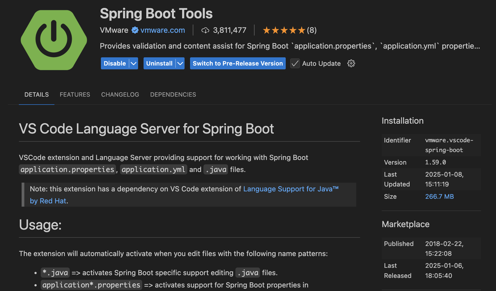

# CST339 - Activity 1

- Date:  **2025 January 08**
- Author:  **Trevor Marr**

## Introduction
- This is the final submission for Activity 1
- This activity will be installing the [Spring Tool Suite (STS)](https://spring.io/tools) on a local computing environment, creating a Spring Boot project and execute a simple **Hello World** application
- The [Maven (MVN)](https://gitlab.com/bobby.estey/wikibob/-/blob/master/docs/maven/README.md?ref_type=heads) tool is an open-source build automation and project management tool that will be used for building projects in this course
- The Project Object Model (POM) an eXtensible Markup Language (XML) file is utilized for project configurations

## Screenshots

- This is a screenshot of the Spring Tool Suite About Box

- This is a screenshot of the Console Output

- This is a screenshot of the Whitelabel Error Page

- This is a screenshot of the Hello World **index.html** page

- This is a screenshot of the Maven Build configurations

- This is a screenshot of the Maven Console, with a **BUILD SUCCESS**

- This is a screenshot of the Java ARchive (JAR) file Execution

## Research Questions

- Place Research Questions here

## Conclusion

- Place a Conclusion here
