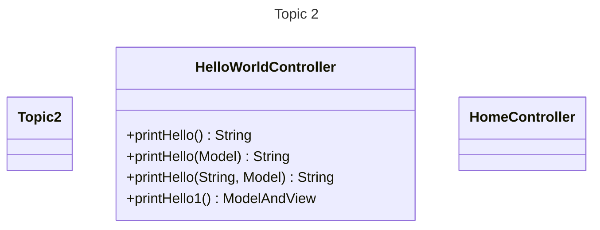

# Topic 2 - Spring Model View Controller (MVC) and Thymeleaf

- This week we are learning about Spring Model View Controller (MVC) and Thymeleaf

## Agendas

- [Agenda 1](agenda1.md)
- [Agenda 2](agenda2.md)
- [Agenda 3](agenda3.md)
- [Agenda 4](agenda4.md)

## Examples:

- [Activity 2](activity02.md)

- [Milestone 2](milestone02.md)
