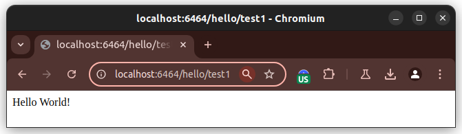
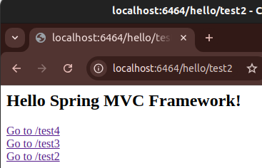
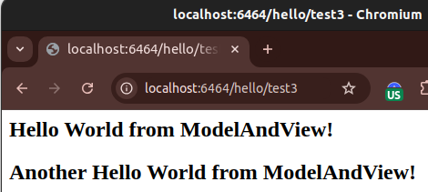
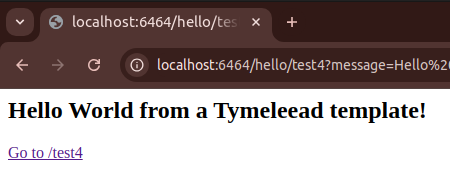
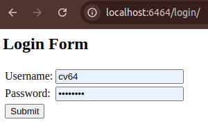
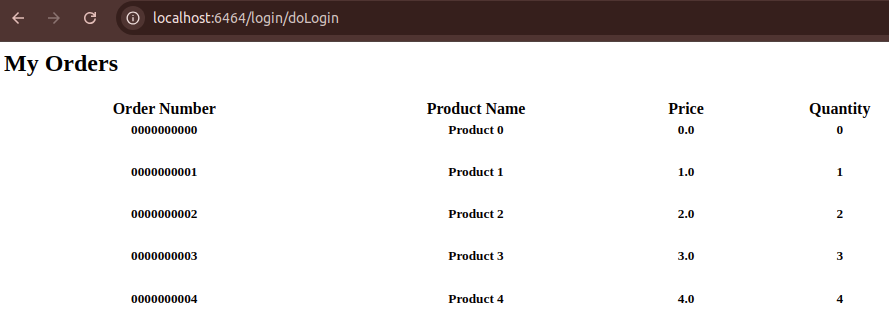
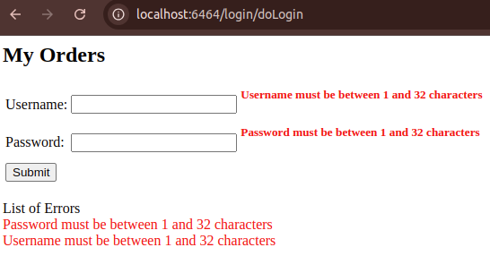
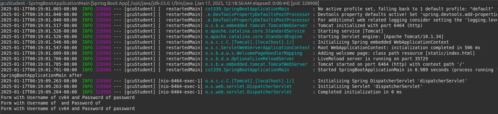
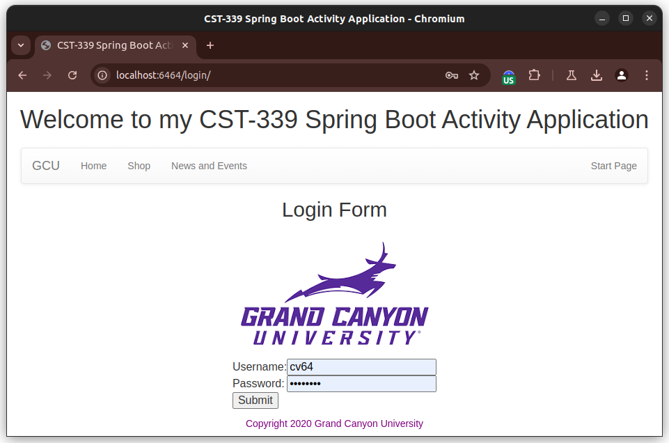
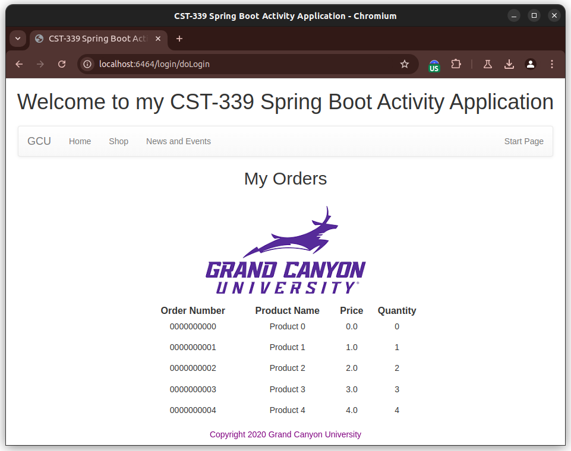

# CST339 - Activity 2

- Date:  2025 January 19
- Author:  Robert Estey

## Introduction

- This activity will provide the following:
     - Creating Models, Views, and Controllers Using Spring Model View Controller (MVC)
     - Creating Forms with Data Validation Using Spring MVC
     - Creating Layouts Using Thymeleaf

## Screenshots

#### Part 1: Creating Models, Views, and Controllers Using Spring MVC

- This is a screenshot of the MVC test screen 1

- This is a screenshot of the MVC test screen 2

- This is a screenshot of the MVC test screen 3

- This is a screenshot of the MVC test screen 4

- This is a screenshot of the MVC test screen Tymeleead

#### Part 2: Creating Forms with Data Validation Using Spring MVC

- This is a screenshot of the Login Form with no data validation

- This is a screenshot of the Login Form posted values in the Console window

- This is a screenshot of the Login Form with data validation errors

- This is a screenshot of the My Orders Console page

#### Part 3: Part 3: Creating Layouts Using Thymeleaf

- [GCU Logo](../../../src/main/resources/static/images/gcu-logo.png)

- This is a screenshot of the Login Page

- This is a screenshot of the Orders Page

## Research Questions - located in Activity Guide

- Post the Questions and Answers

## Conclusion

- Place a Conclusion here
