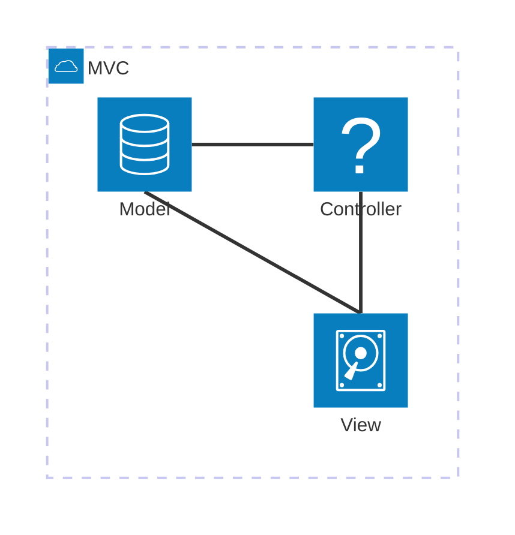

# Topic 2 Agenda - 2

## Creating Forms with Data Validation Using Spring MVC

- [Spring Model, View, Controller (MVC) Example](https://spring.io/guides/gs/serving-web-content)

```mermaid
architecture-beta
    group mvc(cloud)[MVC]

    service model(database)[Model] in mvc
    service view(disk)[View] in mvc
    service controller(controller)[Controller] in mvc

    model:R -- L:controller
    model:B -- T:view
    controller:B -- T:view
```
