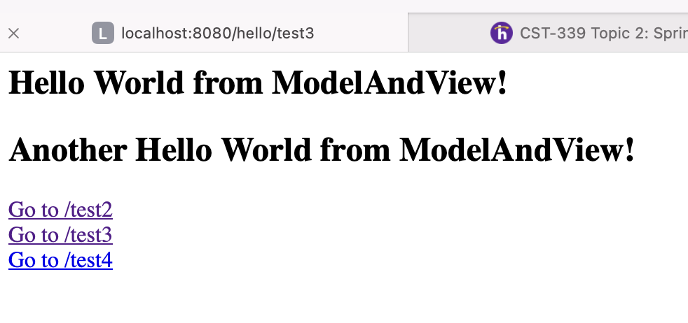

# CST339 - Activity 2

- Date:  2025 Feb 02
- Author:  Trevor Marr

## Introduction

- This activity will provide the following:
     - Creating Models, Views, and Controllers Using Spring Model View Controller (MVC)
     - Creating Forms with Data Validation Using Spring MVC
     - Creating Layouts Using Thymeleaf

## Screenshots

#### Part 1: Creating Models, Views, and Controllers Using Spring MVC

- This is a screenshot of the MVC test screen 1


- This is a screenshot of the MVC test screen 2


- This is a screenshot of the MVC test screen 3



- This is a screenshot of the MVC test screen 4


- This is a screenshot of the MVC test screen Tymeleead


#### Part 2: Creating Forms with Data Validation Using Spring MVC

- This is a screenshot of the Login Form with no data validation


- This is a screenshot of the Login Form posted values in the Console window


- This is a screenshot of the Login Form with data validation errors


- This is a screenshot of the My Orders Console page


#### Part 3: Part 3: Creating Layouts Using Thymeleaf

- [GCU Logo](../../../src/main/resources/static/images/gcu-logo.png)

- This is a screenshot of the Login Page


- This is a screenshot of the Orders Page


## Research Questions - located in Activity Guide

### 1. How does Spring MVC support the MVC design pattern?

Spring MVC is a framework within the Spring ecosystem that facilitates the implementation of the Model-View-Controller (MVC) design pattern. It helps in separating concerns by dividing an application into three main components:

- **Model:** Represents the application's data and business logic.
- **View:** Defines how data is presented to the user, typically in the form of HTML or JSP pages.
- **Controller:** Handles user requests, processes input, and interacts with the model to return appropriate responses.

Spring MVC supports this pattern by using components such as:
- **DispatcherServlet:** Acts as the front controller, handling all incoming requests and directing them to the appropriate controllers.
- **Controller classes (@Controller, @RestController):** Manage user interactions, process data, and return model objects.
- **View Resolvers:** Determine which view should be rendered based on the model data and request parameters.

### Diagram:
```yaml
DispatcherServlet:
  - Receives user request
  - Routes to appropriate Controller

Controller:
  - Processes request
  - Calls Service layer
  - Returns Model and View

Service:
  - Contains business logic
  - Interacts with Repository

Repository:
  - Communicates with Database

View:
  - Receives Model data
  - Renders UI
```

---

### 2. Research and identify two MVC frameworks other than Spring MVC

Here are two popular alternatives to Spring MVC:

#### 1. ASP.NET MVC
   - Developed by Microsoft, ASP.NET MVC is a framework for building web applications using the .NET ecosystem.
   - It follows the MVC pattern with built-in routing, model binding, and Razor views for dynamic HTML rendering.
   - Unlike Spring MVC (Java-based), ASP.NET MVC is designed for C# and integrates seamlessly with Microsoft technologies such as SQL Server and Azure.

#### 2. Ruby on Rails
   - Ruby on Rails (Rails) is a full-stack MVC framework written in Ruby.
   - It emphasizes convention over configuration, providing a streamlined development experience with features like scaffolding and Active Record ORM.
   - Unlike Spring MVC, which offers extensive flexibility and configuration options, Rails provides a more opinionated approach with built-in decisions to enhance developer productivity.

### Key Differences Between Spring MVC, ASP.NET MVC, and Ruby on Rails

| Feature                          | Spring MVC                          | ASP.NET MVC                        | Ruby on Rails                               |
| -------------------------------- | ----------------------------------- | ---------------------------------- | ------------------------------------------- |
| **Language**                     | Java                                | C#                                 | Ruby                                        |
| **Convention vs. Configuration** | Configuration-heavy                 | Balanced                           | Convention-heavy                            |
| **Performance**                  | High performance with optimizations | Fast with .NET Core improvements   | Moderate performance                        |
| **Scalability**                  | Highly scalable for enterprise apps | Scalable within the .NET ecosystem | Suitable for startups and rapid prototyping |
| **Database Access**              | Uses Hibernate, JPA                 | Entity Framework                   | Active Record ORM                           |

These frameworks each provide unique advantages based on the language, ecosystem, and development philosophy.

## Conclusion

- In this activity, I learned how to create a basic Spring Boot controller and troubleshoot issues when the endpoint is not accessible. I gained experience in verifying controller mappings, checking server logs, ensuring the application runs on the correct port, and debugging potential security configurations. This process helped me understand how Spring Boot handles HTTP requests and how to diagnose and resolve common issues effectively. I also learned to basics of Spring MVC and how to make code run smoothly.
