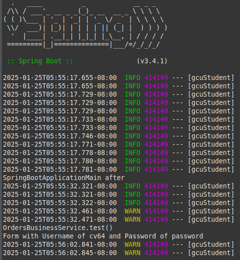
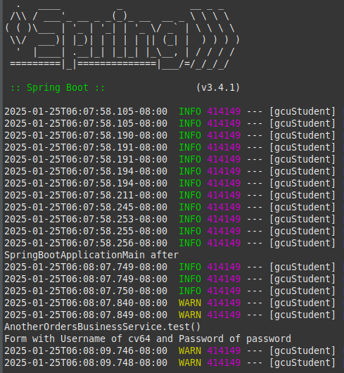
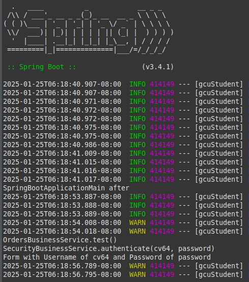
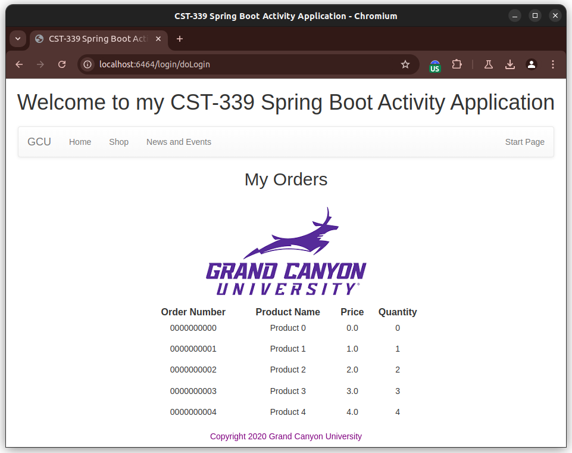
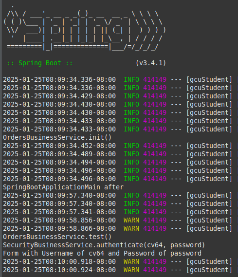
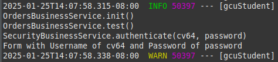
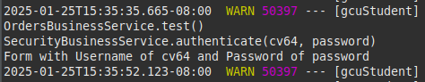
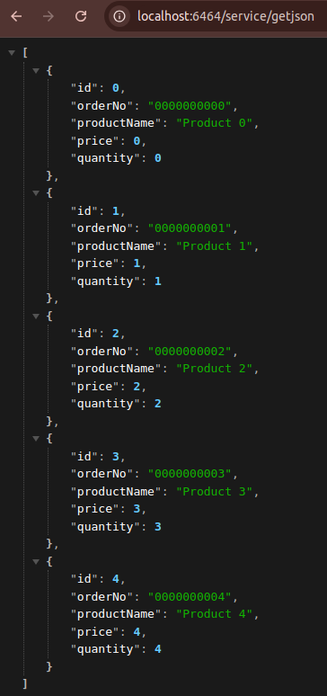
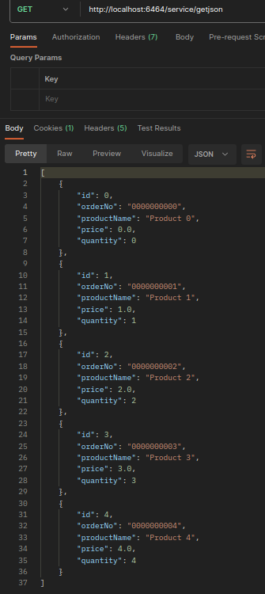
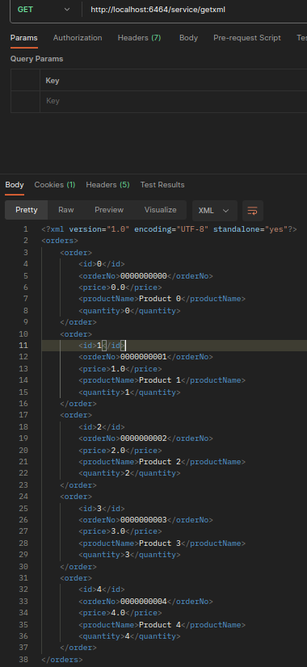

# CST339 - Activity 3

- Date:  2025 January 25
- Author:  Robert Estey

## Introduction

- This activity will provide the following:
     - Configure an application to use the Spring Core framework
     - Design and build Spring Beans using the Spring Core framework
     - Leverage the IoC container in the Spring Framework in support of applying the dependency injection design pattern
     - Design and develop REST API's using the Spring MVC/Spring Data REST and Spring Core frameworks

## Screenshots

#### Part 1:  Creating Models, Views, and Controllers Using Spring MVC

- This is a screenshot of the Interface being called

- This is a screenshot of the Another Interface being called

- This is a screenshot of the Authenticate being called

- This is a screenshot of the Orders page

#### Part 2:  Spring Bean Life Cycle and Scopes

- This is a screenshot of the init method call

- This is a screenshot of the @RequestScope annotation

- This is a screenshot of the @SessionScope annotation

#### Part 3:  Creating REST Services Using Spring REST Controllers

- This is a screenshot of the JSON response

- This is a screenshot of the XML response

- This is a screenshot of the Postman JSON response

- This is a screenshot of the Postman XML response

## Research Questions - located in Activity Guide

- Post the Questions and Answers

## Conclusion

- Place a Conclusion here
