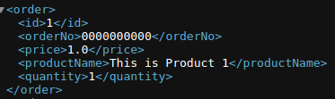
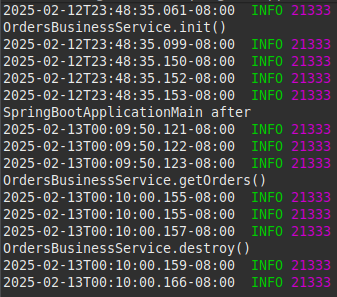

# Topic 3 Agenda - 3

## Please turn your Microphones up - sometimes I can't hear Students when they have questions, Thank You

## Announcements

- Please read the weekly announcements
- Markdown Links, please send the actual link to the Markdown file, not directory, for example:  

```
<path>/activities/activity/README.md
```

## Creating REpresentational State Transfer (REST) Services Using Spring REST Controllers

- [REST](https://gitlab.com/bobby.estey/wikibob/-/blob/master/docs/rest/README.md?ref_type=heads)

## Part 3 Application

- We add two dependencies xml.bin and jaxb-impl 
- Using the XML Binding framework originally called Java XML Binding (JAXB) that allows Java developers to map Java classes to XML representations
- JAXB provides two main features: the ability to marshal Java objects into XML and the inverse, i.e. to unmarshal XML back into Java objects

#### model.OrderModel.java 

- The model directory is the location for your data structures
- The OrderModel Class has 5 attributes, getters and setters and a toString method
- The OrderModel Class is used to instantiate objects of type OrderModel

#### model.OrderList.java

- The OrderList Class uses JAXB to create the <orders> XML wrapper and <order> XML wrapper for each order



#### business.OrderRestService.java 

- Services are located in either business or service directory
- The OrderRestService Class uses both a RequestMapping and @GetMapping annotations
- GetMapping is a subclass or RequestMapping

#### data.repository.OrdersRepository.class

- Performs the query on the database
- Returns a ResultSet of OrderEntities

#### SpringConfig.java

- Call orderBusinessService init method when starting and call destroy method when finished with the Bean
- @Bean(name = "ordersBusinessServce", initMethod = "init", destroyMethod = "destroy")

## Spring Lifecycle

- Call OrderBusinessService.init() - called when Spring starts
- Call OrderBusinessService.getOrders()
- Call OrderBusinessService.destroy() - called when Spring has terminated



## Spring File Structure

- [Spring File Structure](https://gitlab.com/bobby.estey/wikibob/-/blob/master/docs/spring/framework/README.md#file-layout)
