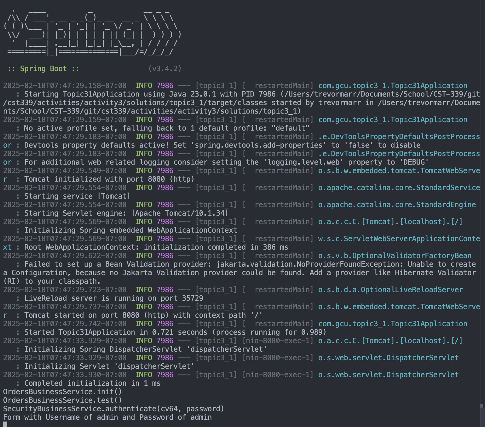
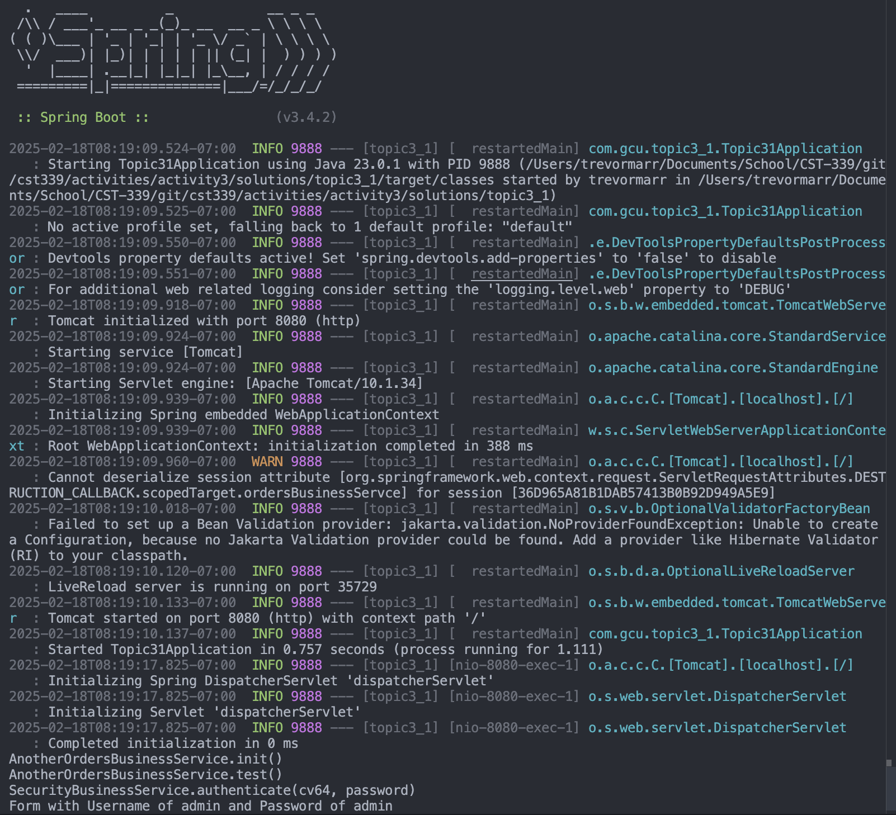
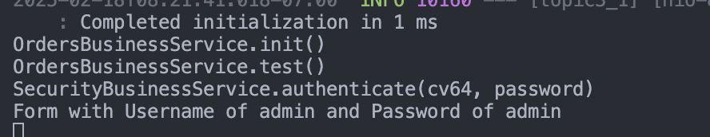
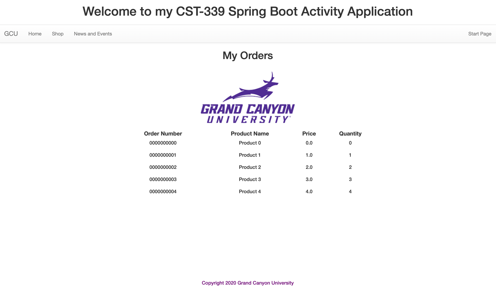
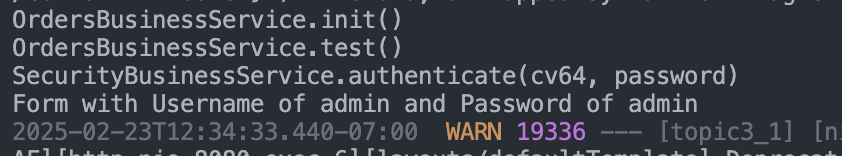
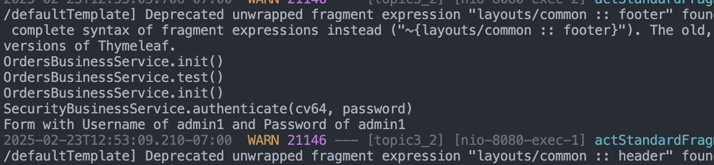
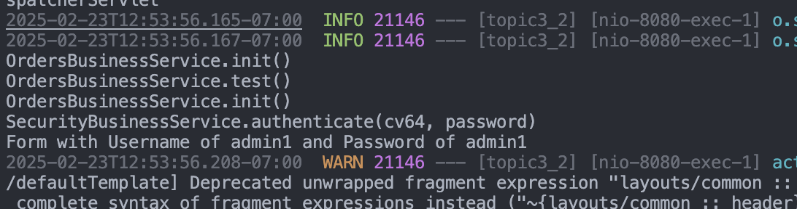
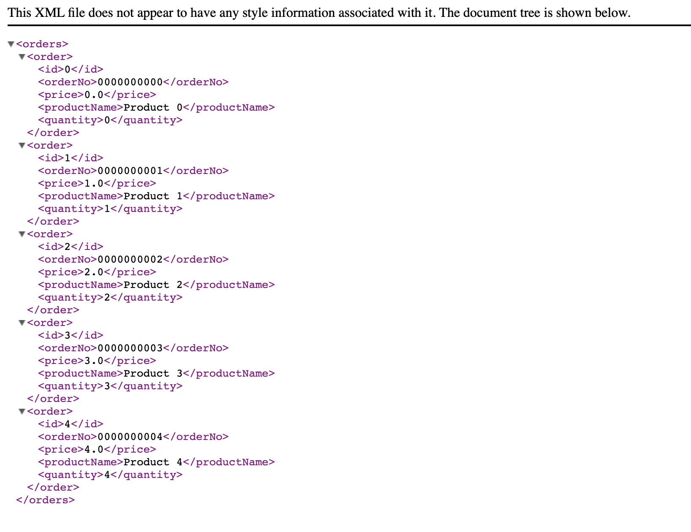
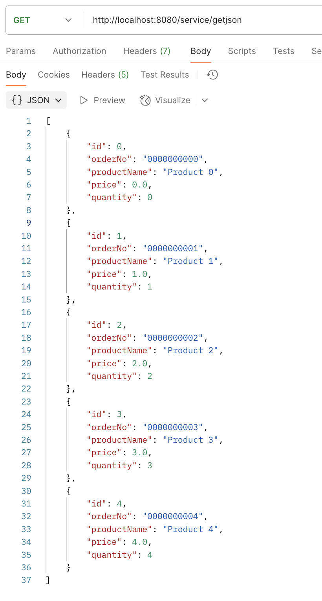
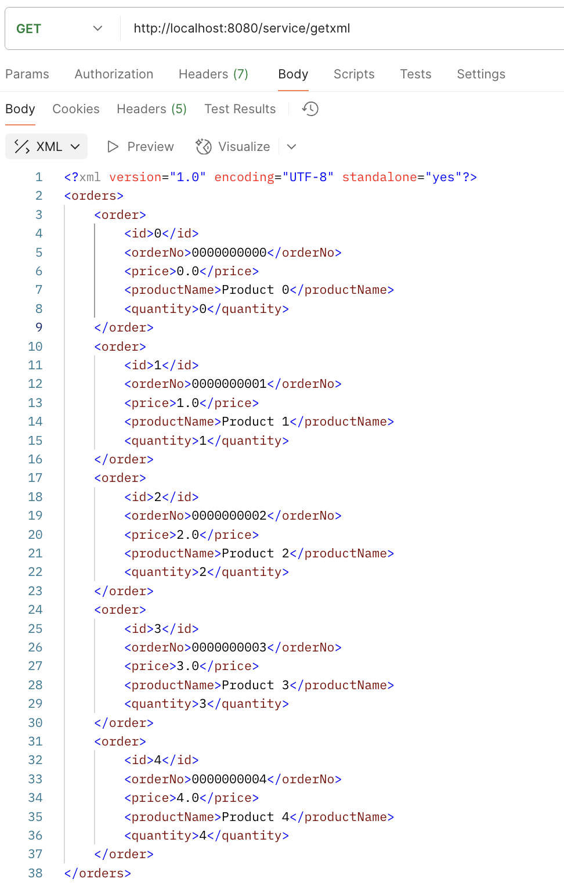

# CST339 - Activity 3

- Date:  2025 Feb 18
- Author: Trevor Marr

## Introduction

- This activity will provide the following:
     - Configure an application to use the Spring Core framework
     - Design and build Spring Beans using the Spring Core framework
     - Leverage the IoC container in the Spring Framework in support of applying the dependency injection design pattern
     - Design and develop REST API's using the Spring MVC/Spring Data REST and Spring Core frameworks

## Screenshots

#### Part 1:  Creating Models, Views, and Controllers Using Spring MVC

- This is a screenshot of the Interface being called

- This is a screenshot of the Another Interface being called

- This is a screenshot of the Authenticate being called

- This is a screenshot of the Orders page

#### Part 2:  Spring Bean Life Cycle and Scopes

- This is a screenshot of the init method call

- This is a screenshot of the @RequestScope annotation

- This is a screenshot of the @SessionScope annotation

#### Part 3:  Creating REST Services Using Spring REST Controllers

- This is a screenshot of the JSON response

- This is a screenshot of the XML response

- This is a screenshot of the Postman JSON response

- This is a screenshot of the Postman XML response

## REST API Report
[View the Report Here](APIDoc.md)
## Research Questions - located in Activity Guide

### 1. What is the difference between the `@Component`, `@Service`, and `@Bean` annotations? When would you use one versus the other?

The `@Component` annotation in Spring is a generic annotation used to define a Spring bean. It can be applied to any class, and Spring will automatically detect it during classpath scanning and register it as a bean in the application context. The `@Service` annotation is a specialization of `@Component`, typically used to annotate service classes that hold business logic. It doesn't add new functionality but serves as a clear indication of the role of the bean, making the code more readable and organized.

The `@Bean` annotation, on the other hand, is used within a `@Configuration` class to define a bean explicitly. Instead of relying on component scanning, you define beans using methods annotated with `@Bean`. This gives more control to the developer, especially in scenarios where you need to instantiate a bean manually, or you need to configure its initialization.

You would use `@Component` for general-purpose bean registration, `@Service` for service-layer beans, and `@Bean` when you need to define beans manually or configure them in specific ways.

### 2. Why does an Inversion of Control (IoC) Container force you to design and code to interface contracts?

An Inversion of Control (IoC) container forces you to design and code to interface contracts because it promotes loose coupling between components. When you code to interfaces rather than concrete classes, it allows for more flexibility in swapping implementations without affecting the rest of the system. This is especially important in a Spring application, where the IoC container is responsible for managing object creation and dependencies. 

By coding to interfaces, it becomes easier to test components (e.g., using mock objects), and you can change implementations or configurations without modifying the dependent code. This approach follows the Dependency Inversion Principle (DIP) and helps in building more maintainable, scalable, and flexible applications.

## Conclusion

- In this activity, I learned how to enhance and add complexity to Spring Boot controllers, as well as troubleshoot issues when REST endpoints aren't accessible. I gained hands-on experience in verifying controller mappings, reviewing server logs, ensuring the application is running on the correct port, and addressing potential security configurations. This process deepened my understanding of how Spring Boot processes HTTP requests and how to efficiently diagnose and resolve common issues. Additionally, I explored the fundamentals of Spring MVC and worked on adding REST endpoints, which helped me ensure that my code runs smoothly and the application performs as expected.
