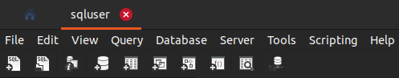
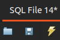
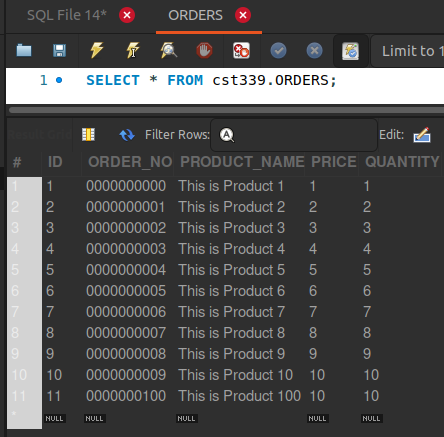
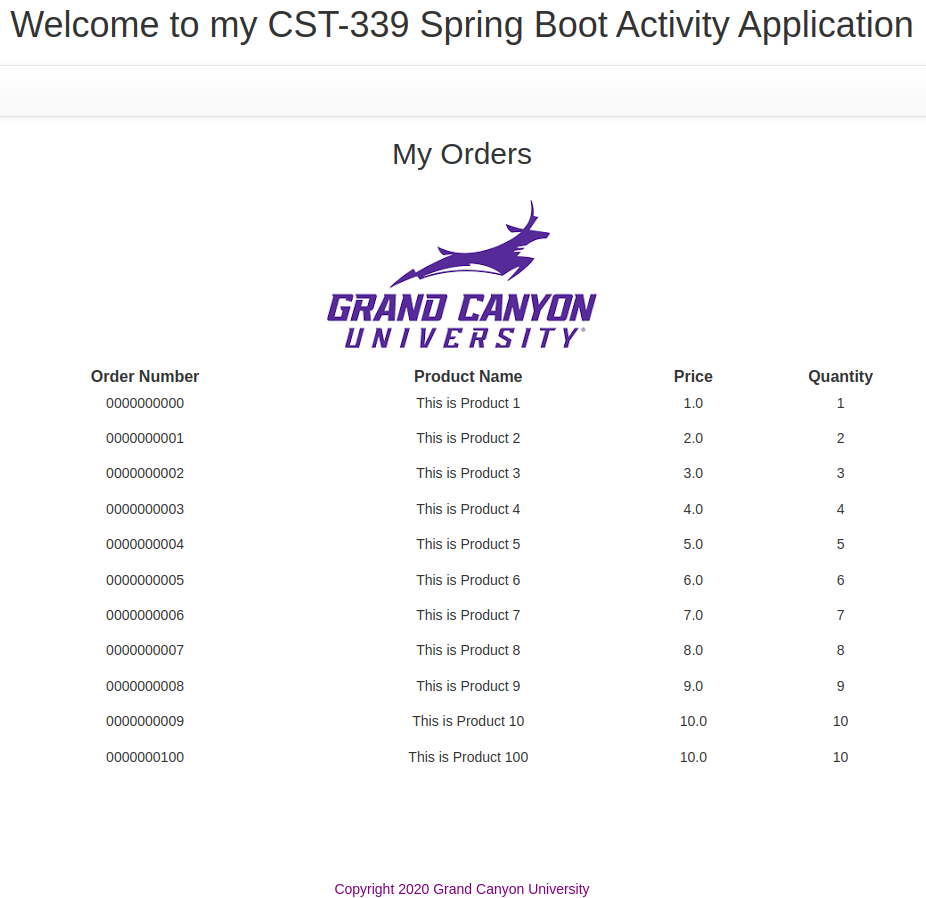

# CST339 - Activity 4

- Date:  2025 January 25
- Author:  Robert Estey

## Introduction

- This activity will provide the following:
     - Configure an application to use Spring Data Java Database Connectivity (JDBC)
     - Persist data using the Data Access Object (DAO)/Repository design pattern to a relational database using Spring Data JDBC

## MySQL Configuration

## src/main/resources/application.properties

```
spring.datasource.url=jdbc:mysql://localhost:3306/cst339
spring.datasource.username=sqluser
spring.datasource.password=password
spring.datasource.driver-class-name=com.mysql.cj.jdbc.Driver
```

- Open up MySQL Workbench
- Select **Create a new SQL tab for executing queries**
- First Icon with SQL Header and Plus "+" under Menu Item File



- Copy and Paste (CST-339-RS-Activity4-MySQL2.txt) in SQL screen
- Press Lightning Bolt without the cursor



- Create a new Query
- Select **Create a new SQL tab for executing queries**
- Type: **SELECT * FROM cst339.ORDERS;**
- Press Lightning Bolt without the cursor
- Validate Table was populated with Data



## Screenshots

#### Part 1:  Creating Data Services Using Spring JDBC

- This is a screenshot of the Orders Page



#### Part 2:  Creating Data Services Using Spring Data JDBC

- This is a screenshot of the Orders Page


#### Part 3:  Creating Data Services Using Spring Data JDBC Native Queries

- This is a screenshot of the Orders Page


## Research Questions - located in Activity Guide

- Post the Questions and Answers

## Conclusion

- Place a Conclusion here
