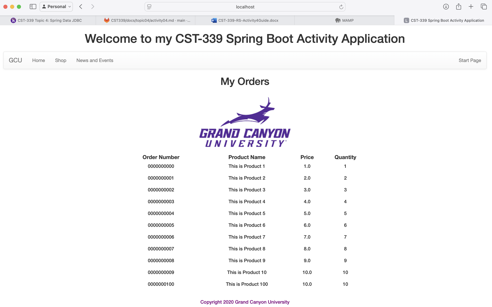
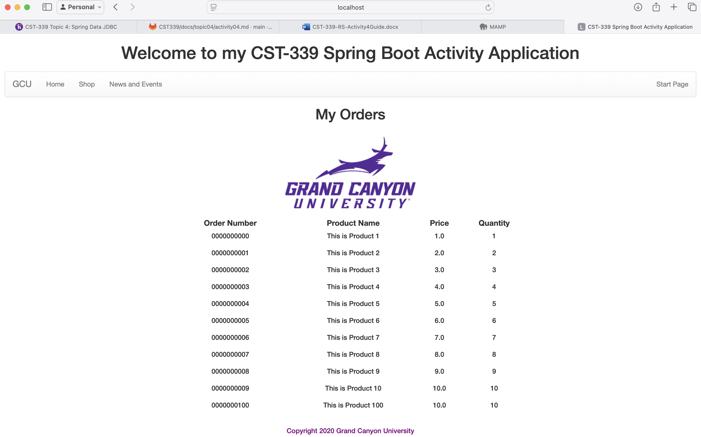

# CST339 - Activity 4

- Date:  2025 March 7
- Author:  Trevor Marr

## Introduction

- This activity will provide the following:
     - Configure an application to use Spring Data Java Database Connectivity (JDBC)
     - Persist data using the Data Access Object (DAO)/Repository design pattern to a relational database using Spring Data JDBC

## Screenshots

#### Part 1:  Creating Data Services Using Spring JDBC

- This is a screenshot of the Orders Page

#### Part 2:  Creating Data Services Using Spring Data JDBC

- This is a screenshot of the Orders Page

#### Part 3:  Creating Data Services Using Spring Data JDBC Native Queries

- This is a screenshot of the Orders Page

## Research Questions - located in Activity Guide

1. **How does Spring Data JDBC differ from standard Java JDBC programming?**  
Spring Data JDBC simplifies database interactions compared to standard Java JDBC by reducing boilerplate code and providing a more declarative approach. With traditional JDBC, developers have to manually manage connections, handle SQL queries, and process result sets, which can lead to repetitive and error-prone code. Spring Data JDBC, on the other hand, abstracts much of this complexity by using repositories and an object-mapping approach, making it easier to work with databases while still maintaining control over SQL execution. Unlike JPA or Hibernate, it avoids lazy loading and proxies, keeping data access straightforward and predictable.  

2. **How does Spring Data JDBC support transaction management and the ACID principle?**  
Spring Data JDBC integrates seamlessly with Spring's transaction management system, allowing developers to manage transactions declaratively using `@Transactional`. This ensures that operations follow the ACID (Atomicity, Consistency, Isolation, Durability) principles by guaranteeing that database changes are executed in a reliable and consistent manner. Transactions can be automatically rolled back if an exception occurs, preventing partial updates and maintaining data integrity. Since Spring Data JDBC works closely with Spring’s `PlatformTransactionManager`, it provides robust support for handling concurrent operations and maintaining consistency across multiple database actions.  

## Conclusion
- In this assignment, I learned how to configure an application to use Spring Data JDBC for database interactions. I explored the differences between Spring Data JDBC and standard Java JDBC programming, noting how Spring Data JDBC simplifies database operations by reducing boilerplate code and providing a more declarative approach. Additionally, I gained an understanding of how Spring Data JDBC supports transaction management and adheres to the ACID principles, ensuring reliable and consistent database operations. This knowledge will be valuable for developing robust and maintainable data access layers in future projects.
