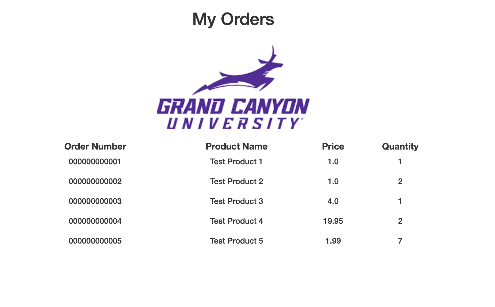
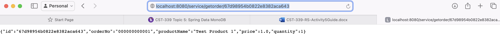

# CST339 - Activity 5

- Date:  2025 March 18
- Author:  Trevor Marr

## Introduction

- This activity will provide the following:
     - Configure an application to use Spring Data MongoDB
     - Persist data using the Data Access Object (DAO)/Repository design pattern to a non-relational database using Spring Data MongoDB

## MongoDB Administration and Configuration

- [MongoDB Sign In](https://mongodb.com)

## Screenshots

#### Part 1:  Creating Data Services Using Spring Data MongoDB

- This is a screenshot of the Orders Page

#### Part 2:  Adding New Queries in the MongoDB Repository

- This is a screenshot an single order by ID.

## Research Questions - located in Activity Guide

Compare and contrast the design of schema in a relational database and a nonrelational database. How do they differ and what impact(s) does migrating from a relational database to a nonrelational database have on your application design?

- A relational database follows a strict schema where data is structured into tables with predefined columns, data types, and relationships. Each table has a primary key, and relationships between tables are established using foreign keys. This structure enforces data integrity, consistency, and normalization, reducing data redundancy. A nonrelational database (NoSQL) does not follow a strict schema. Instead, data can be stored in formats such as key-value pairs, documents (JSON), column families, or graphs. This flexibility allows scalability, faster retrieval, and handling of unstructured data, making it ideal for applications with varying data formats.

Impact of Migrating from Relational to Nonrelational Database
- Schema Flexibility: Moving from a relational to a nonrelational database requires adjusting the application logic to handle dynamic schemas instead of fixed table structures.
- Data Consistency Trade-off: NoSQL databases often prioritize availability and partition tolerance (following the CAP theorem), so developers may need to implement eventual consistency instead of the strong consistency offered by relational databases.
- Querying & Transactions: SQL queries are not available in most NoSQL databases, requiring developers to adjust queries to match NoSQL paradigms (e.g., using MapReduce or aggregation pipelines instead of JOIN operations).
- Performance & Scaling: NoSQL databases provide better horizontal scalability, so migrating may require restructuring data storage to optimize performance.

---

Compare and contrast the features of a relational database and a nonrelational database. Provide three advantages and rationale for why you would select a relational database. Provide three advantages and rationale for why you would select a nonrelational database.

**Relational Database Advantages**
- Data Integrity & ACID Compliance
  - Relational databases enforce Atomicity, Consistency, Isolation, and Durability (ACID), ensuring reliable transactions and preventing data anomalies.
  - Use Case: Banking and financial applications that require strict data consistency.
- Structured Query Language (SQL) for Complex Queries
  - SQL provides powerful querying capabilities, allowing developers to efficiently retrieve, filter, and manipulate data using JOINs, GROUP BY, and HAVING clauses.
  - Use Case: Enterprise applications where complex data relationships exist, such as customer management systems (CRM).
- Data Normalization & Relationships
- Relational databases reduce data redundancy by normalizing tables and ensuring clear relationships via foreign keys.
- Use Case: Inventory management systems where products, orders, and customers are linked.

**Nonrelational Database Advantages**
- Scalability & Performance
  - NoSQL databases are designed for horizontal scaling, meaning they can efficiently handle massive amounts of data by distributing it across multiple servers.
  - Use Case: Social media platforms and big data applications that require fast performance at scale.
- Flexible Schema & Handling Unstructured Data
  - Unlike relational databases, NoSQL databases do not require a predefined schema, allowing dynamic data storage (JSON, BSON, XML).
  - Use Case: Content management systems where different documents (articles, images, videos) have varying structures.
- Better Support for High-Volume, Real-Time Applications
  - NoSQL databases can handle real-time data streams and high-velocity data ingestion, making them ideal for IoT, analytics, and recommendation engines.
  - Use Case: E-commerce product recommendations based on user behavior.

## Conclusion

In this assignment, we explored the use of MongoDB as a non-relational database to persist data in a Spring Boot application. We configured the application to use Spring Data MongoDB and implemented the Data Access Object (DAO)/Repository design pattern to interact with the database. Instead of using MySQL, we leveraged MongoDB's flexible schema to store and retrieve data efficiently. This allowed us to handle dynamic data structures and scale horizontally, demonstrating the advantages of NoSQL databases in modern application development.
