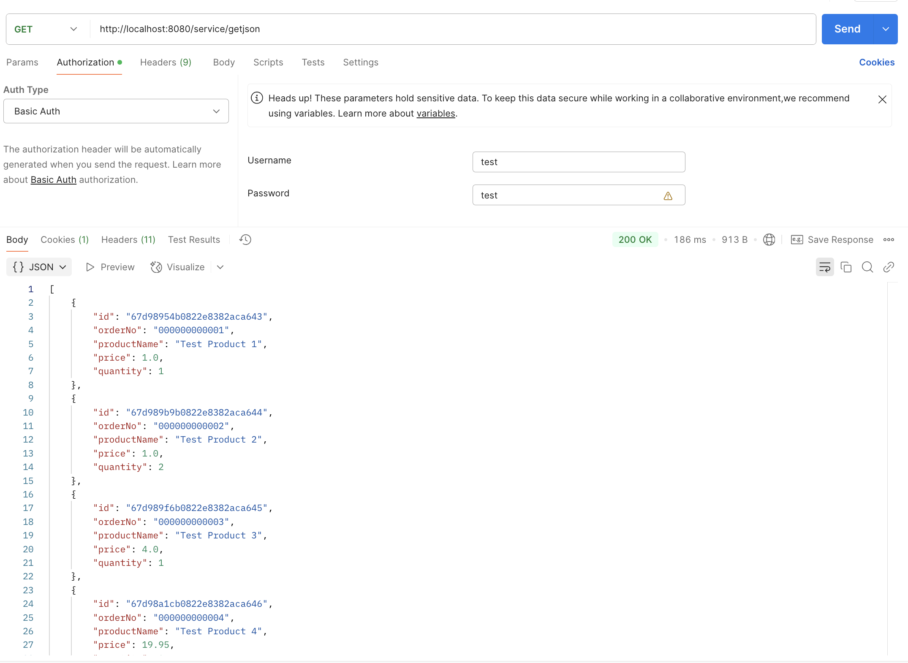
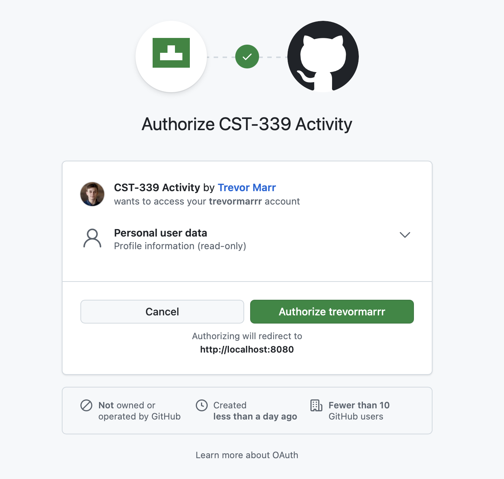

# CST339 - Activity 6 - Spring Security

## Part 1:  Securing a Web Application Using an In-Memory Datastore

### Executing Application in Browser

- This is the login screen to the application

- This is the Orders Page

- This is the original login screen after the user signs out

- This is the login screen when invalid input is sent

### Executing Application in Postman

- This is a screenshot of Postman Get JSON

- This is a screenshot of Postman Get XML

## Part 2:  Securing a Web Application Using a Database

- Part 2 was not achievable with the materials provided by the University

## Part 3:  Securing REST APIs Using Basic HTTP Authentication

- Part 3 was not achievable with the materials provided by the University

## Part 4:  Securing REST APIs Using OAuth2 Authentication

- This is a screenshot of the OAUTH Login Page

- This is a screenshot of the Unsecure Page

- This is a screenshot of the Secure Page

## Research Questions - located in Activity Guide

**1. Research the Forms Based authentication scheme. Describe how this works. Why it is important to use the Spring Security framework versus developing your own custom security framework?**
- Forms-Based Authentication is a common web authentication method where users are presented with a login form to submit their credentials (typically a username and password). Once submitted, the server authenticates the credentials against a user store (like a database), and if valid, creates a session for the user. This session is often tracked using a cookie sent back to the client. On subsequent requests, the client includes the session cookie, allowing the server to identify and authorize the user without requiring them to log in again. While it's a widely used and user-friendly approach, implementing forms-based authentication securely requires handling many details correctly, such as password hashing, session management, CSRF protection, and more. This is where the Spring Security framework becomes essential. Rather than building a custom security solution from scratch—which is complex and error-prone—Spring Security provides a robust, tested, and flexible set of tools for managing authentication and authorization. It includes built-in support for password encryption, session control, security filters, and protection against common vulnerabilities, saving developers time and ensuring a higher level of security.

**2. Research the Basic HTTP authentication schema. Describe how this works. How does this technology help secure a REST API endpoint?**
- Basic HTTP Authentication is a simpler authentication scheme that uses the HTTP header to send credentials. The client includes an Authorization header with a base64-encoded string that contains the username and password. When the server receives this request, it decodes the credentials and validates them against its user store. If valid, access is granted; otherwise, the server returns a 401 Unauthorized response. While this method is straightforward and easy to implement, it does have security limitations—credentials are sent with every request, and if not used over HTTPS, they can be intercepted. However, when used with HTTPS, Basic HTTP authentication can effectively secure REST API endpoints, especially in scenarios like internal services or basic API testing. It provides a stateless way to authenticate requests, which aligns well with REST principles. Nonetheless, for production systems, more secure and scalable solutions like token-based authentication (e.g., JWT or OAuth2) are often preferred.

## Conclusion

- In this activity, I learned about two common authentication methods used in web development: Forms-Based Authentication and Basic HTTP Authentication. I explored how Forms-Based Authentication works by using a login form and server-side session management, and why using a well-established framework like Spring Security is important for ensuring secure and reliable authentication. I also learned how Basic HTTP Authentication uses encoded credentials in request headers to secure REST API endpoints and how it should always be used with HTTPS to prevent security risks. Overall, this activity helped me understand the importance of secure authentication practices and the value of using trusted frameworks.
