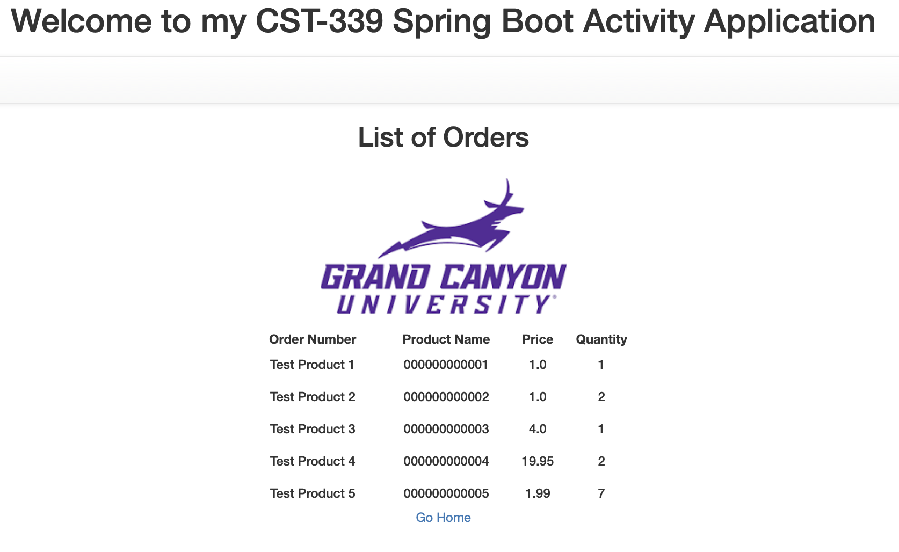

# Activity 7

- Author:  Trevor Marr
- Date:  17 April 2025

## Deliverables

### Part 1: Building a Web App that Consumes Microservices

- Screenshot of home page with hyperlinks to Users and Orders


- Screenshot of users list from the API running on localhost:8081. Data is from MongoDB cluster.


- Screenshot of orders list from the API running on localhost:8082. Data is from MongoDB cluster.



### Part 2: Integrating a REST Service Registry and Discovery Service

- Screenshot of Eureka Dashboard. No services running.


- Screenshot of Eureka Dashboard. `USER-SERVICE` running.


- Screenshot of Eureka Dashboard. `ORDER-SERVICE` running.


- Screenshot of Eureka Dashboard. and the app running on localhost and displaying Users.


- Screenshot of Eureka Dashboard. and the app running on localhost and displaying Orders.


## Research Questions
**1. Research microservices. Describe what they are. How does this architecture style differ from traditional monolithic architectures?**


Microservices are an architectural style where an application is built as a collection of small, independent services that:
- Run in their own processes
- Communicate via lightweight mechanisms (typically HTTP/REST APIs)
- Are independently deployable
- Can be written in different programming languages
- Can use different data storage technologies
- Key differences from monolithic architectures:

| Microservices            | Monolithic               |
|--------------------------|--------------------------|
| Distributed components   | Single deployable unit   |
| Independent scaling      | Scaled as a whole        |
| Technology diversity     | Single technology stack  |
| Isolated failures        | System-wide failures     |
| Separate databases       | Shared database          |


**2. Research microservices. What are 5 challenges you might encounter when modifying a monolithic architecture to this architecture style?**

**Data Management**
- Breaking down shared databases
- Maintaining data consistency across services
- Managing distributed transactions

**Service Communication**
- Implementing reliable service discovery
- Handling network latency
- Managing API versions

**Testing Complexity**
- Integration testing becomes more complex
- Need for end-to-end testing
- Service dependency management

**Deployment Coordination**
- Managing multiple deployment pipelines
- Orchestrating service updates
- Handling backward compatibility

**Monitoring and Debugging**
- Distributed logging challenges
- Transaction tracing across services
- Performance monitoring of the entire system

## Christian Worldview Component
**1. When developing high-performance, database driven applications, could a programmer accidentally compromise user privacy or consumer security? In your response, consider issues such as unambiguous and informed consent, storing data securely, and obtaining permissions to use or share data. Then, choose one situation (either mentioned above or one you've researched). From a Christian worldview perspective, how could the issue be tactfully communicated and addressed to the organization's management when they are concerned with avoiding any type of delays? Provide supporting evidence for your rationale.**

````
Potential Risks:
Storing sensitive data without proper encryption
Insufficient access controls
Unintended data exposure through APIs
Lack of proper data retention policies
Incomplete audit trails
Christian Perspective on Communication:
A biblical approach to addressing these concerns with management could follow these principles:

Truth and Integrity (Proverbs 11:3)

Present clear evidence of risks
Document specific vulnerabilities
Provide concrete examples
Responsible Stewardship (1 Corinthians 4:2)

Emphasize long-term benefits
Present cost-benefit analysis
Highlight reputational risks
Practical Solution

Propose phased implementation
Suggest parallel development tracks
Offer immediate mitigation strategies
Example Approach:
"While I understand the pressure to meet deadlines, our responsibility to protect user data is both a legal and moral obligation. Let me show you how we can address these security concerns while minimizing impact to our timeline..."

This approach aligns with biblical principles of honesty and responsibility while addressing business concerns pragmatically.

Supporting evidence could include:

Recent data breach statistics
Regulatory requirements (GDPR, CCPA)
Industry best practices
Cost of security incidents vs. prevention
````